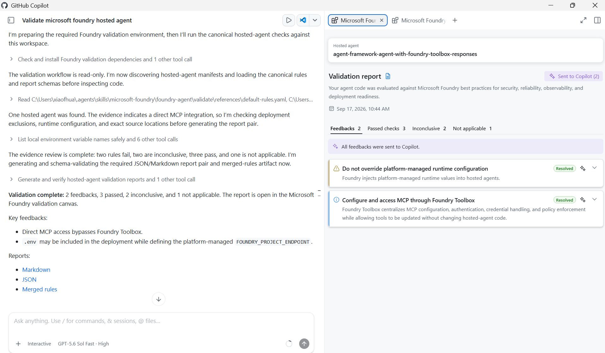
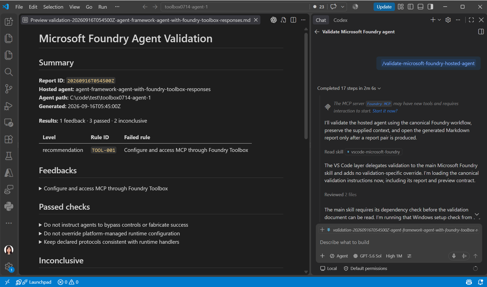

# Microsoft Foundry Hosted-Agent Best Practice Adviser

Use the Best Practice Adviser to review one Microsoft Foundry hosted agent and generate a validation report.

## Choose Where to Use It

Choose the installation for your coding-agent experience.

| Experience | Install | Trigger |
| --- | --- | --- |
| **GitHub Copilot App** | Foundry DevPack | Slash command or natural language |
| **Copilot CLI** | Foundry DevPack | Slash command or natural language |
| **VS Code GitHub Copilot Chat** | Foundry DevPack | Slash command |
| **Other coding agents** | Foundry DevPack installs the Microsoft Foundry Skill and `azd` tools; no host-specific plugin | Natural language |

## Prerequisites

For GitHub Copilot App, GitHub Copilot CLI, and VS Code GitHub Copilot Chat, install [Foundry DevPack](https://learn.microsoft.com/azure/foundry/how-to/develop/install-cli-sdk) as the recommended way to prepare the Microsoft Foundry developer tools, Skill, and host integrations.

### Other Coding Agents

For other coding agents, Foundry DevPack installs the Microsoft Foundry Skill and `azd` tools without a host-specific plugin. Load the Skill in your coding agent and trigger validation with natural language.

## Use in GitHub Copilot App

1. Open the hosted-agent workspace.
2. Enter `/validate-microsoft-foundry-hosted-agent`.
3. Optionally add `agentPath`.
4. Submit the command.
5. Review the report in the Best Practice Adviser Canvas.



Example:

```text
/validate-microsoft-foundry-hosted-agent agentPath=C:\code\contoso-agent
```

## Use in Copilot CLI

Start Copilot CLI in the hosted-agent folder:

```powershell
copilot -C C:\code\contoso-agent
```

Then run:

```text
/validate-microsoft-foundry-hosted-agent
```

Copilot CLI returns the generated JSON and Markdown report paths. The report Canvas is available in GitHub Copilot App.

## Use in VS Code GitHub Copilot Chat

1. Open the hosted-agent workspace in VS Code.
2. Open GitHub Copilot Chat.
3. Switch to **Agent** mode.
4. Enter `/validate-microsoft-foundry-hosted-agent`.
5. Submit the command.
6. Review the generated Markdown report.



Example:

```text
/validate-microsoft-foundry-hosted-agent agentPath=C:\code\contoso-agent
```

## Use in Other Coding Agents

Install the Microsoft Foundry Skill into your coding agent:

```powershell
npx skills add https://github.com/microsoft/azure-skills --skill microsoft-foundry
```

If your coding agent uses its own skill manager, install the `microsoft-foundry` skill from [microsoft/azure-skills](https://github.com/microsoft/azure-skills) with that manager.

Open the hosted-agent workspace and use this natural-language prompt:

```text
Use the Microsoft Foundry Skill to validate the hosted agent in this workspace against Microsoft Foundry best practices.
```

## Other Usages

### Add Custom Rules

There are two ways to add custom validation rules.

Custom rule files must follow the [Microsoft Foundry validation rules schema](https://github.com/microsoft/GitHub-Copilot-for-Azure/blob/main/plugins/azure-skills/skills/microsoft-foundry/foundry-agent/validate/references/rules-schema.json).

#### Add Rules to the Agent Workspace

Create:

```text
<agentPath>\.foundry\agent-validation-rules.yaml
```

When the file uses this location and name, the adviser discovers it automatically. You do not need to pass `rulesFile`.

Example:

```yaml
version: 1.0.0
scope: Contoso hosted-agent rules

rules:
  - id: CONTOSO-001
    title: Require an operational runbook
    level: recommendation
    rationale: A runbook gives operators a consistent incident response path.
    when: Apply to every production hosted agent.
    checks: >-
      Check for a runbook that identifies ownership, rollback steps,
      and escalation contacts.
    statusCriteria:
      pass: The runbook includes ownership, rollback, and escalation details.
      fail: A runbook exists but explicitly omits a required section.
      inconclusive: The repository does not show whether an external runbook exists.
    guidance:
      - title: Contoso hosted-agent operations standard
        link: https://example.com/contoso/hosted-agent-operations
```

Run the command normally:

```text
/validate-microsoft-foundry-hosted-agent agentPath=C:\code\contoso-agent
```

#### Pass a Rules File

If the custom rules file is stored anywhere else, pass its path with `rulesFile`:

```text
/validate-microsoft-foundry-hosted-agent agentPath=C:\code\contoso-agent rulesFile=C:\rules\custom-rules.yaml
```

If a custom rules file is invalid, the adviser stops and explains the validation errors.

### Specify One Agent in a Multi-Agent Workspace

Each command validates one hosted agent.

When a workspace contains multiple agents, use `agentPath` to point to the folder for the agent you want:

```text
/validate-microsoft-foundry-hosted-agent agentPath=C:\code\contoso-agents\support-agent
```

For example:

```text
C:\code\contoso-agents\
  support-agent\
    azure.yaml
  sales-agent\
    azure.yaml
```

To validate the sales agent:

```text
/validate-microsoft-foundry-hosted-agent agentPath=C:\code\contoso-agents\sales-agent
```

If the selected path still contains multiple hosted agents, Copilot asks you to choose one interactively. For unattended use, provide a path that identifies only one agent.

### Trigger with Natural Language

```text
Use the Microsoft Foundry Skill to validate the hosted agent in this workspace against Microsoft Foundry best practices.
```

For a specific agent:

```text
Use the Microsoft Foundry Skill to validate the hosted agent under C:\code\contoso-agent.
```

### Choose an Output Folder

```text
/validate-microsoft-foundry-hosted-agent agentPath=C:\code\agent outputPath=D:\validation-results
```

### Choose a Report ID

```text
/validate-microsoft-foundry-hosted-agent agentPath=C:\code\agent reportId=local-2026-09-16
```

## Find the Markdown Report

By default, the Markdown report is saved at:

```text
<agentPath>\.foundry\results\validation-<reportId>.md
```

If you specify `outputPath`, find the report in that folder instead.

- **GitHub Copilot App** automatically opens the validation report in the Best Practice Adviser Canvas.
- **VS Code GitHub Copilot Chat** automatically opens the generated Markdown report in a preview.
- **Copilot CLI and other coding agents** return the report path in their response.

## Resolve Feedback

### GitHub Copilot App

Use the Copilot action on one feedback item, or select **Resolve with Copilot** to send all feedbacks. Review the proposed changes and the new report after validation runs again.

### VS Code GitHub Copilot Chat

1. Use the generated Markdown report that VS Code opened.
2. Open GitHub Copilot Chat in **Agent** mode.
3. Add the report file to the chat context.
4. Ask Copilot to resolve one or all feedbacks.

Example:

```text
Resolve all feedbacks in this Microsoft Foundry Best Practice Adviser report. Make the required code changes, run the appropriate tests, and validate the agent again.
```

Review the code changes and the new validation report.

## Troubleshooting

### The Command Is Missing in GitHub Copilot App or CLI

Check:

```powershell
copilot skill list
copilot plugin list
```

Reinstall the plugin if needed:

```powershell
copilot plugin install microsoft/foundry-dev-tools:microsoft-foundry
```

### The Command Is Missing in VS Code

Confirm that Microsoft Foundry Toolkit is installed and enabled, then reload VS Code.

### No Agent Is Found

Check that `agentPath` is correct and the target has an `azure.yaml` service with `host: azure.ai.agent`.
